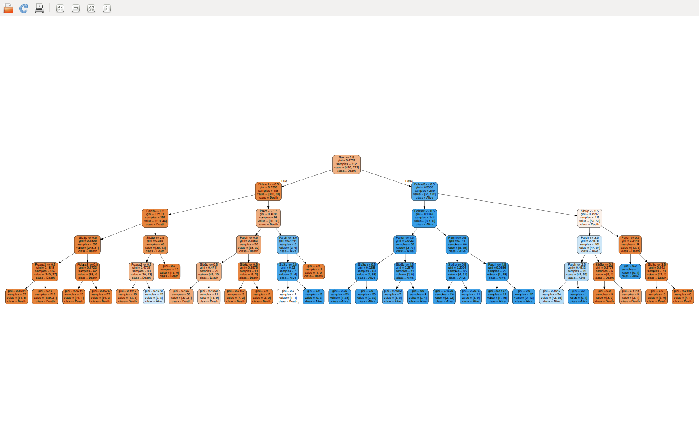

# Kaggle
This repository contain my competition algorythm on Kaggle

You'll find in this repository the following competition algorithm :    
[- Titanic survivors prediction using a Decision Tree with visualization (ranking : 2368/3843 on Kaggle)](/KaggleTitanic.py) see details on [Kaggle Titanic](https://www.kaggle.com/c/titanic)

[- Ipad sales prediction on eBay with Linear Discriminant Aanalysis (ranking : 1328/1885 on Kaggle)](/KaggleiPad.py) see details on [Kaggle eBay Ipads](https://inclass.kaggle.com/c/15-071x-the-analytics-edge-summer-2015)    
[- Happiness most influential factors (ranking : TBD/1685 on Kaggle)](/KaggleHappiness.py) see details on [Kaggle Happiness poll](https://www.kaggle.com/c/the-analytics-edge-mit-15-071x)
