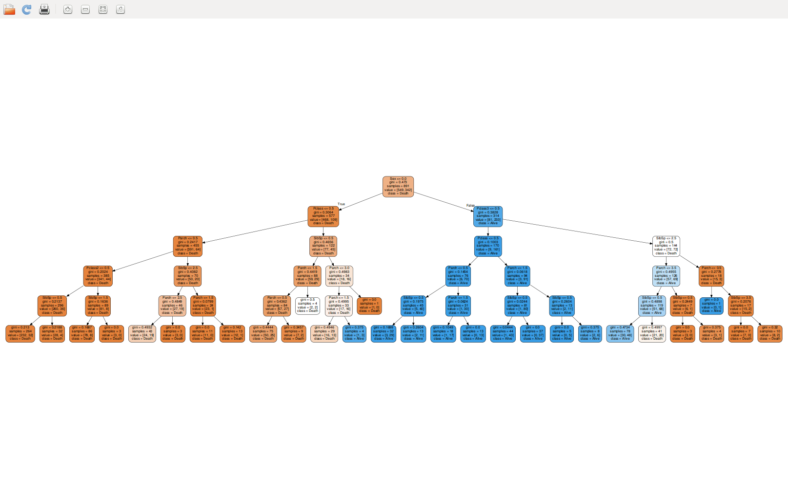

# Kaggle data science competitions
----------------------------------
This repository contains my first competition algorithm on Kaggle

You'll find in this repository samples of competition algorithm with the following operations :
- Data transformation (Categories formatting)
- Train test split (Sampling)
- Algorithm testing (Tree classifier)
- Data vizualisation (Graph)    

[- Titanic survivors prediction using a Decision Tree with visualization (ranking : top tier on Kaggle)](/KaggleTitanic.py) see details on [Kaggle Titanic](https://www.kaggle.com/c/titanic)

[- Ipad sales prediction on eBay with Linear Discriminant Aanalysis (ranking : top tier on Kaggle)](/KaggleiPad.py) see details on [Kaggle eBay Ipads](https://inclass.kaggle.com/c/15-071x-the-analytics-edge-summer-2015)    
[- Happiness most influential factors (ranking : TBD/1685 on Kaggle)](/KaggleHappiness.py) see details on [Kaggle Happiness poll](https://www.kaggle.com/c/the-analytics-edge-mit-15-071x)    
